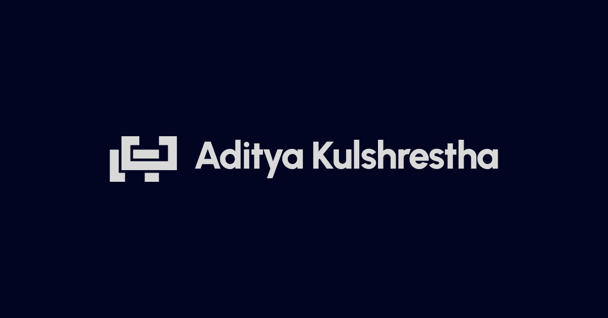

# Aditya Kulshrestha @ [adikul.dev](https://adikul.dev)

## Projects

This repository contains the source code for my personal website [adikul.dev](https://adikul.dev).

## Description

This project is built using Next.js, React, Tailwind CSS, and other technologies. It serves as my personal website showcasing my projects, blog posts, resume, and more.

## Contents

- [Projects](#projects)
- [Blog](#blog)
- [Resume](#resume)
- [Contact](#contact)

## Hello World, I am Aditya Kulshrestha

A software engineer by trade; A filmmaker, drummer, and minimalist by passion.

## Recent Blog Posts

[Insert recent blog posts here]

## Recent Projects

[Insert recent projects here]

## Contact

- Phone: +91 78408 69129
- Email: hello@adikul.dev
- LinkedIn: [linkedin.com/in/adikul358](https://www.linkedin.com/in/adikul358/)
- GitHub: [github.com/adikul358](https://github.com/adikul358/)

2024 © Aditya Kulshrestha

